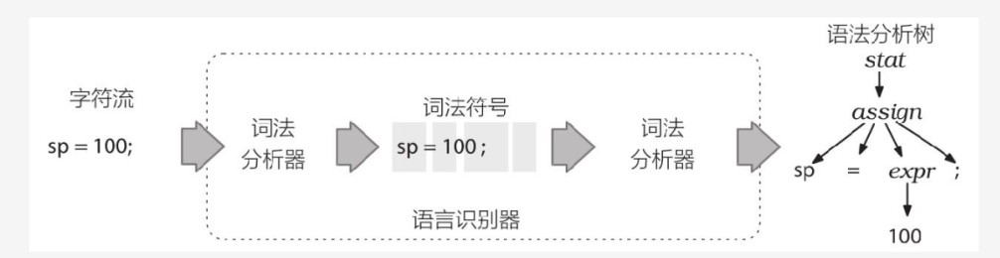
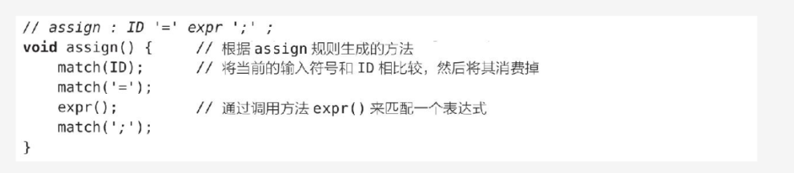
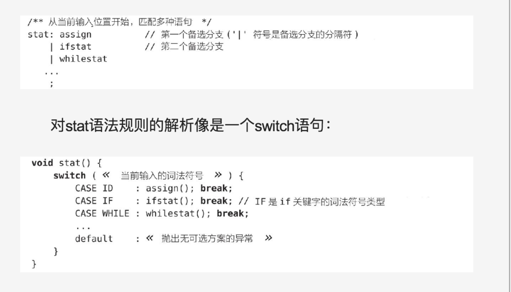

## ANTLR基本概念释义
### 第一阶段  编写句法和词法
  1. 语法分析器或句法分析器:识别语言的程序
  2. 句法（sytanx）: 约束语言中各个组成部分之间的关系规则
  3. 语法（grammar）: 是一系列规则的集合，每条规则标识一种词汇结构
  4. 词法分析：将字符聚集为单词或者符号(词法符号token)的过程称为词法分析
  5. 词法分析器:将输入文本转换为词法符号的程序
     - 词法分析器：可以将先关词法符号进行归类，INT,ID标识符,FLOAT浮点数。
     - 词法符号包含信息: 词法符号类型和该词法符号对应的文本
### 第二阶段 实际的语法分析过程
  1. 根据输入的词句根据语法规则解析为语法分析树，下图为解析字符流动过程：

        1. 根节点为stat
        2. 叶节点为词法符号
  2. 语法分析器的理解:
     1. 递归下降语法分析器：实际上是若干递归方法的集合，下降过程为从根节点向叶子节点进行解析。
     2. 递归下降语法分析器的实现细节:
        1. 通过 stat()，assign(),expr()调用路线图映射到语法分析树节点上
        2. 通过 match()对应语法分析树的叶子节点
            
        3. 多分支选择的实现细节 
        
     3.ANTLR解决歧义性的方法:选择所有匹配的备选分支第一条
  ###  通过语法分析树来构建语言类应用：
  1. 创建创建描述语言的语法  .g4 的文件
  2. 根据 .g4 文件 使用ANTLR工具类生成对应一系列文件
     1. Parser.class :语法分析器类，识别语言使用
     2. Lexer.class  :ANTLR能够自动识别出语法中的文法和词法规则
     3. tokens  :ANTLR 会给每个我们定义的词法符号指定一个数字形式的类型，将他们的对应关系存储在文件中，有时我们需要将一个大型语法切分成小型语法时使用
     4. Listener : ANTLR生成的语法分析器将输入文本转换为一棵语法分析树，在遍历语法分析树时 遍历器会触发一系列事件（回调）并通知我们提供的监听对象。我们可以实现此接口完成自定义功能。
  3. 生成的语法分析器与java集成

  